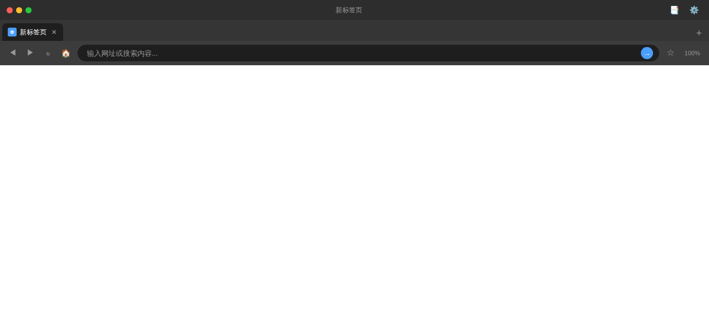
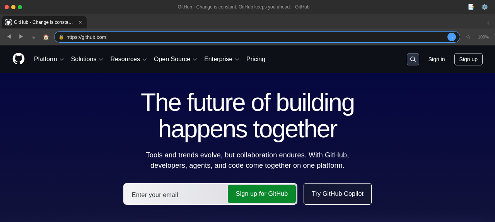
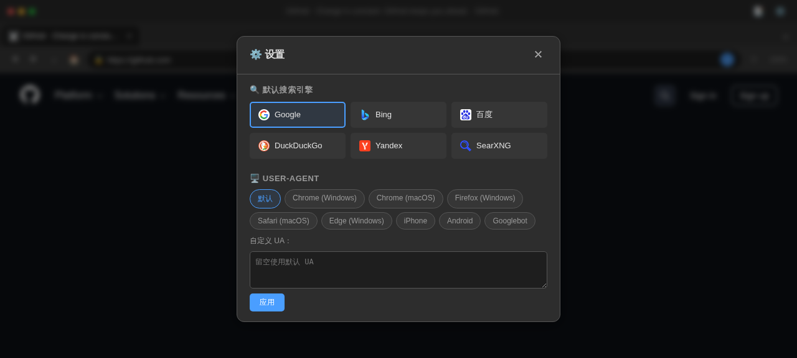

# 🌐 WebTab Browser

> 在一个浏览器标签页内运行的全功能网页浏览器

WebTab Browser 是一个基于 Node.js + 纯前端的网页浏览器，通过反向代理技术实现在单个标签页内浏览任意网站。适合嵌入到 Electron、WebView、Chrome 99+ 内核等受限环境中使用。

## ✨ 功能特性

| 功能 | 说明 |
|------|------|
| 📑 标签页管理 | 新建、关闭、切换、拖拽排序、右键菜单（复制/固定/关闭其他/关闭右侧） |
| 🔍 地址栏导航 | 输入网址自动跳转，输入关键词自动搜索 |
| 🔎 搜索引擎切换 | Google / Bing / 百度 / DuckDuckGo / Yandex / SearXNG |
| ⭐ 书签系统 | 一键收藏、书签栏显示、书签管理器（增删） |
| 🖥️ User-Agent 切换 | 8 种预设（Chrome/Firefox/Safari/Edge/iPhone/Android/Googlebot）+ 自定义 |
| 🔭 页面缩放 | 25% ~ 300% 滑块控制 + 快捷按钮 |
| ◀▶ 前进/后退 | 完整的浏览历史导航 |
| 🏠 主页设置 | 自定义主页或默认新标签页 |
| ⌨️ 丰富的快捷键 | 新建标签、关闭标签、聚焦地址栏、收藏、缩放等 |
| 🌙 暗色主题 | 现代深色 UI，视觉舒适 |
| 🎯 Chrome 99 兼容 | 完全兼容 Chrome 99 内核，可嵌入 Electron/WebView |

## 📸 截图

### 新标签页


### 浏览网页


### 设置面板


## 🚀 快速开始

### 环境要求

- Node.js 18+
- npm 或 pnpm

### 安装运行

```bash
# 克隆仓库
git clone https://github.com/kmh1145/web-browser.git
cd web-browser

# 安装依赖
npm install

# 启动服务
node server.js
```

然后打开浏览器访问 `http://localhost:9090`

### 自定义端口

```bash
PORT=8080 node server.js
```

## 🏗️ 技术架构

```
┌─────────────────────────────────────────────┐
│                 浏览器标签页                   │
│  ┌─────────────────────────────────────────┐ │
│  │          WebTab Browser UI              │ │
│  │  ┌────────┐ ┌────────┐ ┌────────┐      │ │
│  │  │ 标签页1 │ │ 标签页2 │ │ 标签页3 │ ... │ │
│  │  └────────┘ └────────┘ └────────┘      │ │
│  │  ┌─────────────────────────────────────┐│ │
│  │  │ ◀ ▶ ↻ 🏠 │ https://... │ ☆  100% ││ │
│  │  └─────────────────────────────────────┘│ │
│  │  ┌─────────────────────────────────────┐│ │
│  │  │           <iframe>                  ││ │
│  │  │     通过代理加载的外部网站内容         ││ │
│  │  │                                     ││ │
│  │  └─────────────────────────────────────┘│ │
│  └─────────────────────────────────────────┘ │
└─────────────────────────────────────────────┘
           │                    ▲
           │ /proxy?url=...     │ HTML (重写后的)
           ▼                    │
┌─────────────────────────────────────────────┐
│          Node.js Express 代理服务器           │
│                                              │
│  • 获取目标网页内容                            │
│  • 剥离 X-Frame-Options / CSP 头             │
│  • 重写 HTML 中的链接为代理路径                │
│  • 处理 gzip/brotli 解压                     │
│  • 代理 favicon                              │
└─────────────────────────────────────────────┘
           │
           ▼
┌─────────────────────────────────────────────┐
│              目标网站服务器                     │
└─────────────────────────────────────────────┘
```

### 为什么需要代理？

大多数网站通过以下 HTTP 头阻止被嵌入 iframe：

- `X-Frame-Options: DENY` / `SAMEORIGIN`
- `Content-Security-Policy: frame-ancestors 'none'`

WebTab Browser 的代理服务器在转发响应时会移除这些头，并重写 HTML 中的资源链接，使所有请求都经过代理，从而实现在 iframe 中浏览任意网站。

## 📁 项目结构

```
web-browser/
├── server.js              # Express 代理服务器
├── package.json
├── README.md
├── screenshots/           # 项目截图
│   ├── newtab.png
│   ├── browsing.png
│   └── settings.png
└── public/
    ├── index.html         # 主页面
    ├── style.css          # 样式（暗色主题）
    └── app.js             # 前端逻辑
```

## ⌨️ 快捷键

| 快捷键 | 功能 |
|--------|------|
| `Ctrl + T` | 新建标签页 |
| `Ctrl + W` | 关闭当前标签页 |
| `Ctrl + L` | 聚焦地址栏 |
| `Ctrl + R` | 刷新页面 |
| `Ctrl + D` | 收藏/取消收藏 |
| `Ctrl + 1-9` | 切换到第 N 个标签页 |
| `Ctrl + Tab` | 切换到下一个标签页 |
| `Ctrl + Shift + Tab` | 切换到上一个标签页 |
| `Ctrl + +` | 放大 |
| `Ctrl + -` | 缩小 |
| `Ctrl + 0` | 重置缩放 |
| `Alt + ←` | 后退 |
| `Alt + →` | 前进 |

## 🔧 配置说明

所有用户设置（搜索引擎、UA、缩放、主页、书签）通过浏览器 `localStorage` 持久化，无需服务端存储。

### 环境变量

| 变量 | 默认值 | 说明 |
|------|--------|------|
| `PORT` | `9090` | 服务监听端口 |

## 🌍 兼容性

- ✅ Chrome 99+ / Chromium 99+
- ✅ Firefox 90+
- ✅ Safari 15+
- ✅ Edge 99+
- ✅ Electron / WebView / CEF

## ⚠️ 注意事项

- 本项目仅供学习和个人使用
- 代理功能会绕过网站的 iframe 限制，请尊重目标网站的使用条款
- 代理服务器不做内容缓存，所有请求实时转发
- 部分网站的复杂 JS 交互可能受限于 iframe 沙箱策略

## 📄 License

MIT
